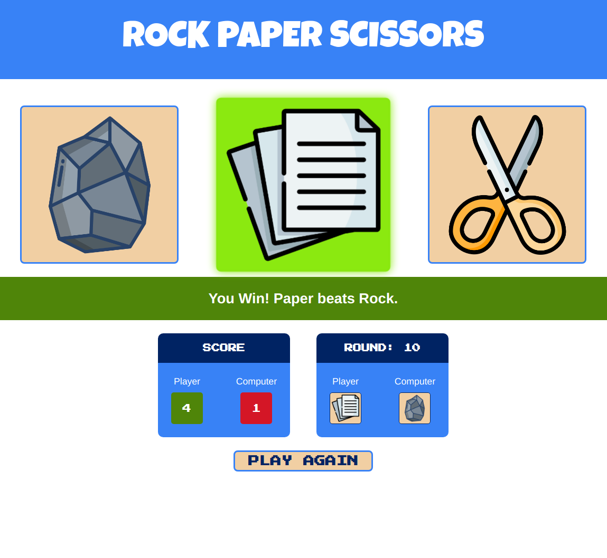
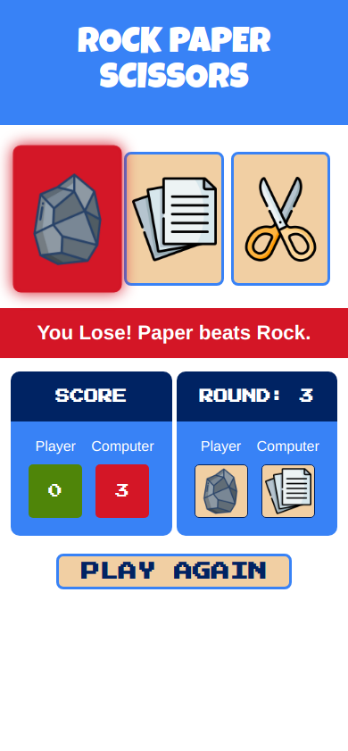

# Odin Project #3: Rock Paper Scissors

The goal of this Odin Project assignment was to create a simple rock paper scissors game played against the computer.

I started and finished this project in June 2022.

## Assignment

[The Odin Project - Foundations - #3 Part 1 Rock Paper Scissors](https://www.theodinproject.com/lessons/foundations-rock-paper-scissors)

[The Odin Project - Foundations - #3 Part 2 Revisiting Rock Paper Scissors](https://www.theodinproject.com/lessons/foundations-revisiting-rock-paper-scissors)

## Technology

- HTML
- CSS
- Vanilla JavaScript

## Key Concepts

- DOM manipulation: querySelector, getElementById and addEventListener
- Functions, return values, forEach loop
- Math functions: floor and random
- Comparison operators: strict equality
- Variables and scope
- Branches in Git

## Links

[Live Demo](https://bn7631-odin-rock-paper-scissors.pages.dev)

## Screenshots

### Desktop



### Mobile



## Sources

- https://www.flaticon.com/free-icons/stone by Icongeek26 - Flaticon
- https://www.flaticon.com/free-icons/paper by Freepik - Flaticon
- https://www.flaticon.com/free-icons/scissors by Freepik - Flaticon
- https://fonts.google.com/specimen/Luckiest+Guy
- https://fonts.google.com/specimen/Press+Start+2P

## Deployment

```bash
  git clone https://github.com/BrightNeon7631/odin-rock-paper-scissors.git
```
